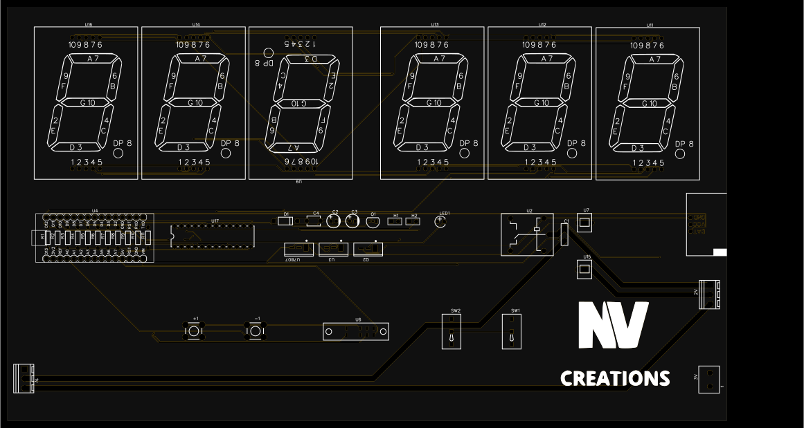
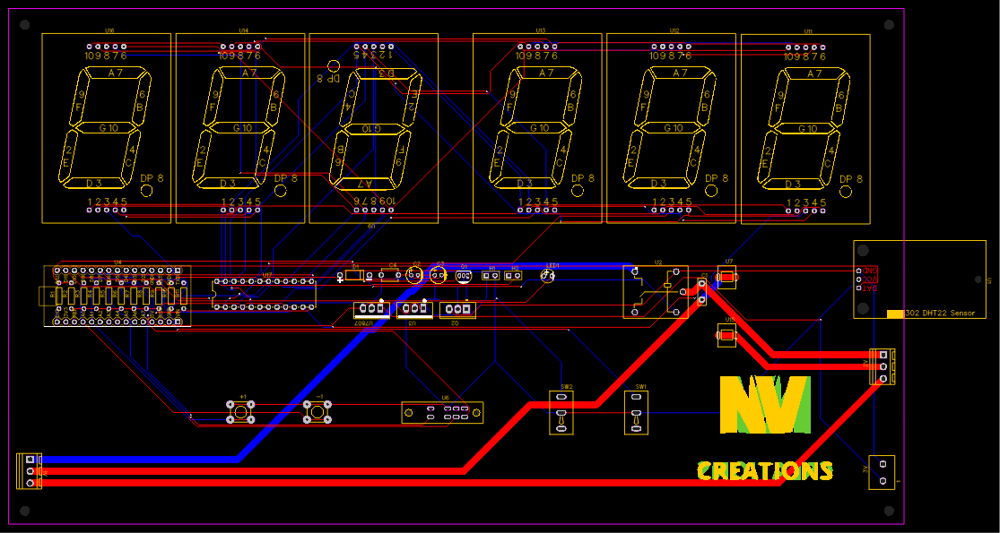
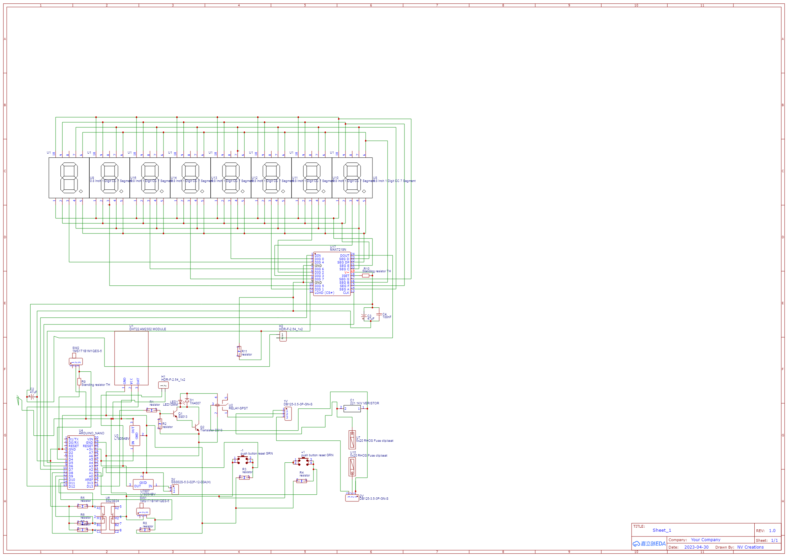

# NV-SmartEnv-Industrial

**NV-SmartEnv-Industrial** is a robust, industrial-grade Arduino-based temperature and humidity controller and display system.  
This project combines the capabilities of the **NV-SmartEnv-Controller** and **NV-MAX7219-LargeSeg** display module, offering highly visible environmental monitoring and automation suited for industrial environments.

## 🔧 Features

- ✅ Monitors temperature and humidity using a sensor (DHT22)
- ✅ Displays real-time readings on a **large 0.8'' 7-segment display** (MAX7219-based)
- ✅ No need for a PC – fully programmable through onboard buttons
- ✅ Set temperature/humidity thresholds for switching external devices (like fans, alarms)
- ✅ Built-in **safety features**:
  - Fuse protected
  - Earth grounding
  - Varistor shielding against voltage spikes and lightning
- ✅ Industrial-grade visibility — designed for **long-distance readability**
- ✅ All features of [NV-SmartEnv-Controller](https://github.com/NVCreations33/NV-SmartEnv-Controller) included
- ✅ Easy to customize for different automation tasks

## 🧠 Customization Ideas

- Industrial coolers or fans
- Greenhouse monitoring
- Humidity-based drying systems
- Remote server room alerts

## 📁 Project Contents

| File/Folder                 | Description                                         |
|----------------------------|-----------------------------------------------------|
| `schematic.png`            | Schematic diagram of the circuit                    |
| `pcb_layout.png`           | PCB layout preview                                  |
| `top_view.svg`             | SVG render of final board                           |
| `gerber.zip`               | Gerber files for fabrication                        |
| `easyeda.json`             | EasyEDA project file                                |
| `LICENSE`                  | License information (CC BY-NC-SA 4.0)               |

## 📐 PCB Specs

- Size: `264.16mm x 152.27mm`
- Display: 5-digit 0.8" 7-segment (MAX7219)
- Microcontroller: Arduino Nano

## 🖼️ Previews

## 📜 License

This project is licensed under the  
**[Creative Commons Attribution-NonCommercial-ShareAlike 4.0 International (CC BY-NC-SA 4.0)](https://creativecommons.org/licenses/by-nc-sa/4.0/)**

- ✅ Free for personal and educational use
- ❌ Commercial use **not allowed** without permission
- 🔄 Modifications must be shared under the same license
- ✏️ Credit must be given to the original creator

---

Feel free to fork, contribute, or suggest improvements.  
**NV Creations** – Freelance Developer | PCB Designer | Problem Solver

